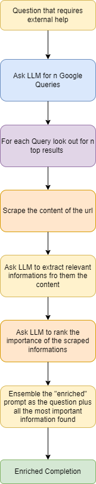

# DataEnricherLLM
DataEnricherLLM is a Python project that aims to enhance the capabilities of Language Learning Models (LLMs), such as ChatGPT. It is inspired by the functionalities of a now-disabled browser add-on from ChatGPT, but expands and refines these capabilities to meet contemporary needs.

The main goal of DataEnricherLLM is to provide a reliable and efficient method of enriching a prompt for an LLM. This feature enables a user to receive a more accurate and well-informed response from the LLM, without having to be concerned about response time.

DataEnricherLLM fetches relevant information from the web and provides this data to the LLM. By doing so, the project seeks to significantly improve the quality and relevance of LLM-generated text, and provide users with an overall more satisfactory experience.

## Important
There's an article on Medium about this project https://bottari.medium.com/rewriting-openai-web-browsing-plugin-from-scratch-d0d1317ae9ba and you may want to check that out if you are interested.

## Quick reference of what is does
In the article on Medium is explained the high level algo, but this is basically it:

## Note
To make it running it's necessary to create the usual .anv file as follow:
OPENAI_API_KEY=YOUR_OPEN_AI_KEY